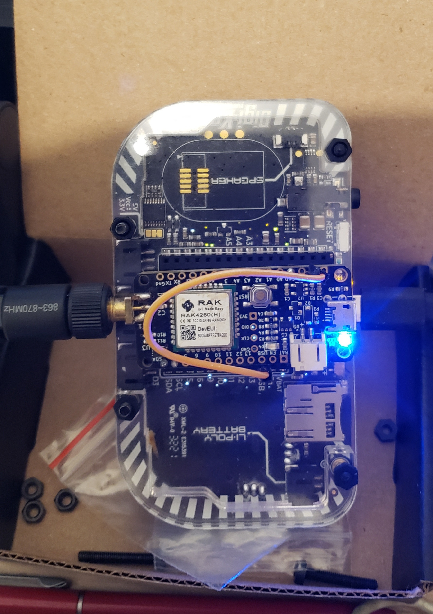
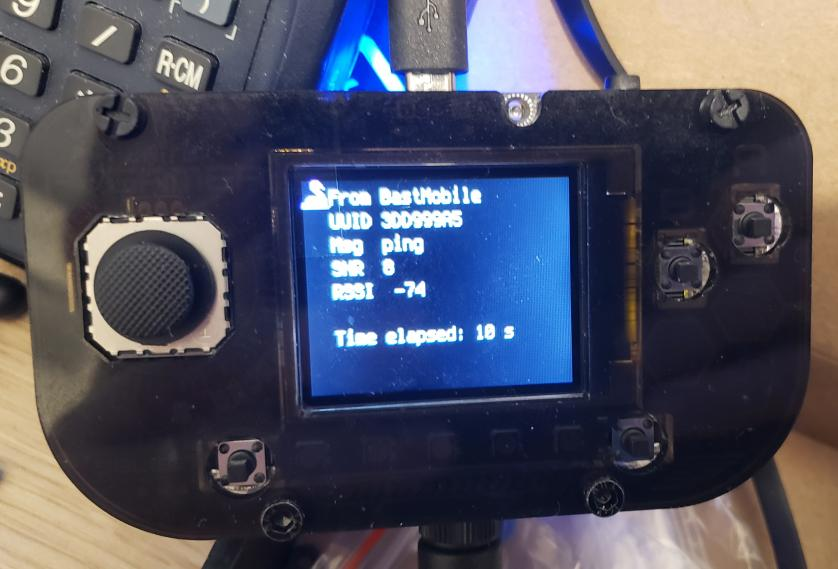

# BastWAN_I2C_LoRa_Bridge

See this [Twitter thread](https://twitter.com/Kongduino/status/1525331309878743042) for background info. This is the first half of the project, the Bastwan side of things. The PyGamer code is [here](https://github.com/Kongduino/PyGamer_LoRa_Tester).

Since the PyGamer has Feather headers at the back, I thought it would be a cool idea to stick a BastWan there and use the whole setup as a LoRa distance test kit. However there are a few issues, notable plugging in a BastWanas is freezes the PyGamer – I suspect one of the Vcc pins conflicts with it; it is nigh impossible to cross Tx1 and Rx1 on either side. So I decide to switch to I2C for communication between the devices – which works fine. The back layer makes connecting the BastWan a little difficult, and it wobbles a lot, especially on 3 or 4 pins only – for now I have only 3 pins connecter, SDA, SCL, GND, leaving 3V connected by a Dupont cable so that I can remove it and connect the USB cable instead when I want to look at the Serial Monitor. I added female headers to give more space to the BastWan – and its SMA antenna connector – and things are now more stable. Adding pins on both sides – those that won't cause a freeze, like the Ax and Dx pins – helps too.

*3 pins and a cable*

*Adding female headers helps stabilizing the BastWan*

To make things simple and fast, I am using for now the [termio library by BeBoXos](https://github.com/beboxos/Circuitpython-termio-lib), which works great. I get to have a small UI with zero effort thanks to this library. It is sure not sexy, but this is (Circuit)Python. If I wanted sexy I'd use something else, and a bigger screen.

*Simple, fast and efficient!*

It doesn't mean we can't do a little fancy! Since the PyGamer has 5 neopixels, we might has well make use of them. Here's what it looks like when a message is received:

*Isn't that cute?*

The plan is to add quite a few more features, but for now it'll do!

### Notable tidbits

The `Commands.h` implements a text commands system that is easily extendable, and very easy to use. Also, while I am not making use of it in this early version, it comes with batteries included, aka AES encryption. Finally, the I2C communication code is probably worth a look.